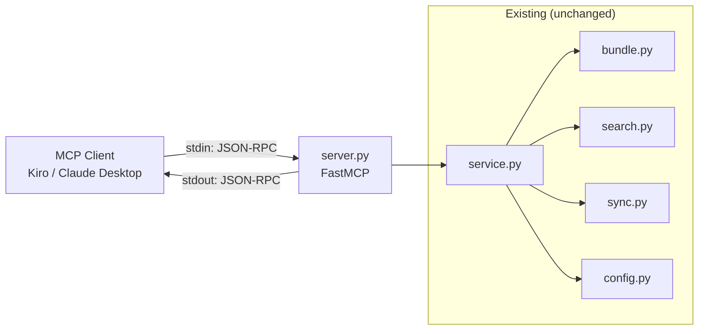
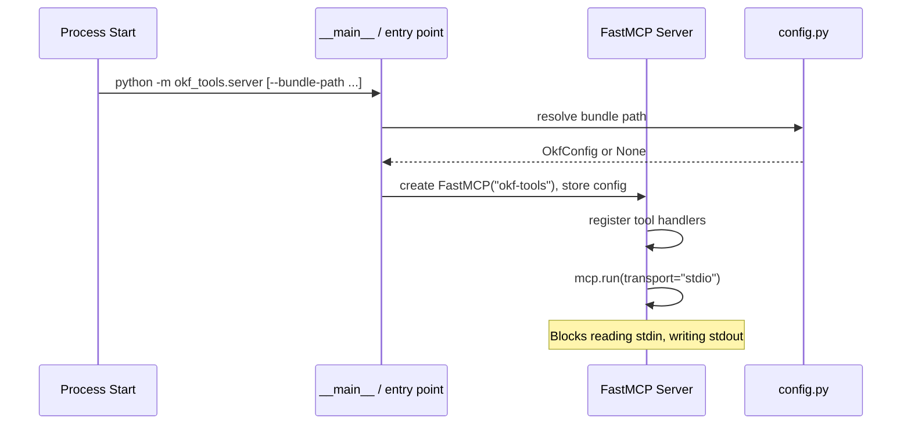
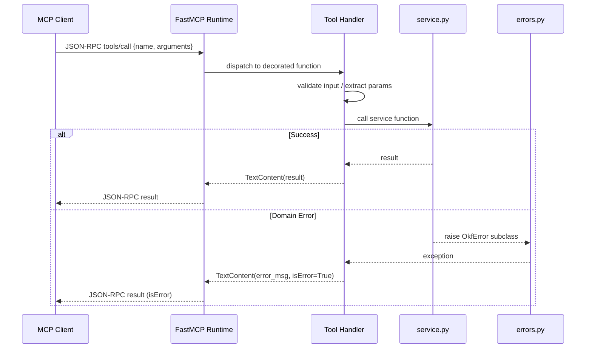

# Design Document: MCP Server

## Overview

This feature adds an MCP (Model Context Protocol) server to okf-tools, exposing the existing `service.py` functions as MCP tools over stdio transport. The architecture is a thin adapter layer: the MCP server receives JSON-RPC requests via stdin, routes them to the corresponding service function, and writes JSON-RPC responses to stdout.

The core modules (`bundle.py`, `search.py`, `sync.py`, `config.py`, `errors.py`) remain unchanged. The new `server.py` module provides tool handler functions decorated with the MCP SDK's `@mcp.tool()` decorator. Each handler validates input, calls the appropriate service function, translates the return value to MCP tool content, and maps domain errors to MCP error responses.

Key design decisions:
- **MCP Python SDK (`mcp` package)**: Uses the official `FastMCP` high-level API rather than raw JSON-RPC handling. This provides tool registration via decorators, automatic JSON Schema generation from type hints, and built-in stdio transport.
- **Single module**: All tool handlers live in `src/okf_tools/server.py` — the service layer already encapsulates complexity, so the server module stays flat.
- **Lazy bundle resolution**: The server resolves the bundle path at startup (via `--bundle-path` or `find_bundle_root`), but allows running without a bundle so `init_bundle` can be called.
- **No stdout contamination**: All logging goes to stderr to keep the stdio JSON-RPC channel clean.

## Architecture



### Startup Flow



### Request Flow



## Components and Interfaces

### New Module: `src/okf_tools/server.py`

The single new source file containing:

1. **Server instance** — `mcp = FastMCP("okf-tools")` at module level
2. **State** — A module-level `_config: Optional[OkfConfig]` resolved at startup
3. **Tool handlers** — One `@mcp.tool()` decorated async function per service operation
4. **Error wrapper** — A helper that catches `OkfError` subclasses and returns appropriate MCP error responses
5. **Entry point** — A `main()` function that parses `--bundle-path`, resolves config, and calls `mcp.run(transport="stdio")`

### Tool Handler Interface

Each tool handler follows this pattern:

```python
@mcp.tool()
async def tool_name(param1: str, param2: int = 5) -> str:
    """Tool description shown to MCP clients."""
    _require_bundle()  # raises if no bundle configured (except init_bundle)
    try:
        result = service.some_function(config, ...)
        return _format_result(result)
    except OkfError as e:
        raise _to_mcp_error(e)
```

### Tool Mapping

| MCP Tool Name    | Service Function         | Parameters                                                              |
|------------------|--------------------------|-------------------------------------------------------------------------|
| `init_bundle`    | `service.init_bundle`    | `path?: str`                                                            |
| `commit_concept` | `service.commit_concept` | `title: str`, `type: str`, `content: str`, `tags?: list`, `path?: str`, `check_duplicates?: bool` |
| `update_concept` | `service.update_concept` | `concept_id: str`, `title?: str`, `type?: str`, `tags?: list`, `content?: str` |
| `delete_concept` | `service.delete_concept` | `concept_id: str`                                                       |
| `fetch_concepts` | `service.fetch_concepts` | `query: str`, `top_n?: int`, `threshold?: float`, `type?: str`, `tags?: list`, `mode?: str` |
| `list_concepts`  | `service.list_concepts`  | `type?: str`, `tags?: list`, `since?: str`, `limit?: int`, `path?: str` |
| `show_concept`   | `service.show_concept`   | `concept_id: str`                                                       |
| `reindex`        | `service.reindex`        | `full?: bool`                                                           |
| `get_stats`      | `service.get_stats`      | (none)                                                                  |

### Error Handling Helper

```python
def _to_mcp_error(error: OkfError) -> McpError:
    """Map domain errors to MCP tool error responses."""
    if isinstance(error, ValidationError):
        return McpError(INVALID_PARAMS, "\n".join(error.errors))
    elif isinstance(error, ConceptNotFoundError):
        return McpError(INVALID_PARAMS, f"Concept not found: {error.concept_id}")
    elif isinstance(error, BundleAlreadyInitialisedError):
        return McpError(INVALID_PARAMS, str(error))
    else:
        return McpError(INTERNAL_ERROR, "An internal error occurred")
```

### Entry Point Configuration

Added to `pyproject.toml`:

```toml
[project.scripts]
okf = "okf_tools.cli:okf"
okf-mcp = "okf_tools.server:main"
```

This gives users `okf-mcp` as the command to start the MCP server. MCP client configurations reference this entry point.

### New Dependency

```toml
dependencies = [
    # ... existing ...
    "mcp>=1.0,<2.0",
]
```

The `mcp` package (official MCP Python SDK) provides `FastMCP`, stdio transport, and the JSON-RPC protocol implementation. It depends on `pydantic`, `anyio`, and `httpx` but these are lightweight and well-maintained.

## Data Models

### Input/Output Schemas

The MCP SDK generates JSON Schema from Python type hints automatically. The tool handlers use these types:

```python
from typing import Optional, List

# init_bundle
class InitBundleParams:
    path: Optional[str] = None

# commit_concept
class CommitConceptParams:
    title: str
    type: str
    content: str
    tags: Optional[List[str]] = None
    path: Optional[str] = None
    check_duplicates: bool = True

# update_concept
class UpdateConceptParams:
    concept_id: str
    title: Optional[str] = None
    type: Optional[str] = None
    tags: Optional[List[str]] = None
    content: Optional[str] = None

# fetch_concepts
class FetchConceptsParams:
    query: str
    top_n: int = 5
    threshold: float = 0.0
    type: Optional[str] = None
    tags: Optional[List[str]] = None
    mode: str = "hybrid"

# list_concepts
class ListConceptsParams:
    type: Optional[str] = None
    tags: Optional[List[str]] = None
    since: Optional[str] = None
    limit: int = 100
    path: Optional[str] = None
```

Note: With FastMCP's `@mcp.tool()` decorator, these don't need to be explicit Pydantic models — the SDK infers the schema from function signatures and type annotations. The classes above document the contract.

### Tool Response Formats

All tool responses are serialized as JSON strings in MCP `TextContent`:

```python
# Success: commit_concept
{"concept_id": "patterns/my-pattern"}

# Success: fetch_concepts
{"results": [
    {"concept_id": "...", "title": "...", "score": 0.87, "snippet": "..."},
    ...
]}

# Success: list_concepts
{"concepts": [
    {"concept_id": "...", "title": "...", "type": "...", "tags": [...]},
    ...
]}

# Success: show_concept
{"concept_id": "...", "title": "...", "type": "...", "tags": [...], 
 "description": "...", "timestamp": "...", "body": "..."}

# Success: reindex
{"added": 5, "updated": 2, "removed": 1, "skipped": 0, "total_indexed": 42}

# Success: get_stats
{"concept_count": 42, "type_distribution": {...}, "tag_distribution": {...},
 "last_reindex_timestamp": "...", "pending_reembedding_count": 3}

# Error response (isError=true)
"Concept not found: patterns/nonexistent"
```

### Existing Data Models (unchanged)

- **`Concept`** (bundle.py) — in-memory representation of a concept file
- **`SearchResult`** (search.py) — semantic search result with score and snippet
- **`SyncSummary`** (sync.py) — reindex operation result counts
- **`OkfConfig`** (config.py) — resolved configuration with paths and thresholds


## Correctness Properties

*A property is a characteristic or behavior that should hold true across all valid executions of a system — essentially, a formal statement about what the system should do. Properties serve as the bridge between human-readable specifications and machine-verifiable correctness guarantees.*

### Property 1: Commit-then-show round-trip preserves data

*For any* valid combination of title, type, content, and tags, committing a concept via `commit_concept` and then retrieving it via `show_concept` with the returned concept_id SHALL produce a response containing the original title, type, content (body), and tags.

**Validates: Requirements 3.2, 8.2**

### Property 2: Missing required fields are enumerated in validation error

*For any* non-empty proper subset of the required fields {title, type, content} that is omitted from a `commit_concept` invocation, the returned validation error SHALL list exactly those missing fields and no others.

**Validates: Requirements 3.3**

### Property 3: Update applies only provided fields

*For any* existing concept and any non-empty subset of update fields {title, type, tags, content}, invoking `update_concept` SHALL change only the specified fields and leave all other fields at their prior values.

**Validates: Requirements 4.2**

### Property 4: Invalid updates are rejected without modifying the concept

*For any* existing concept and any update that would produce invalid frontmatter (empty type string, non-ISO-8601 timestamp, non-list tags), the `update_concept` tool SHALL return a validation error and the concept file SHALL remain unchanged from its state before the call.

**Validates: Requirements 4.5**

### Property 5: Delete removes concept and returns concept_id

*For any* concept that exists in the bundle, invoking `delete_concept` SHALL return the concept_id in the success response, and the concept file SHALL no longer exist on disk afterward.

**Validates: Requirements 5.2**

### Property 6: Search results have valid structure

*For any* search query that returns results from `fetch_concepts`, each result SHALL contain a concept_id (non-empty string), title (string), score (float in range [0.0, 1.0]), and snippet (string with length ≤ 200 characters).

**Validates: Requirements 6.2**

### Property 7: Whitespace-only queries are rejected

*For any* string composed entirely of whitespace characters (spaces, tabs, newlines), invoking `fetch_concepts` with that string as the query SHALL return a validation error.

**Validates: Requirements 6.5**

### Property 8: List results are sorted and structurally complete

*For any* bundle state with one or more concepts, invoking `list_concepts` SHALL return results where each entry contains concept_id, title, type, and tags fields, and the results are sorted in ascending alphabetical order by concept_id.

**Validates: Requirements 7.2**

### Property 9: Stats response has correct structure and types

*For any* configured bundle, invoking `get_stats` SHALL return an object containing concept_count (integer ≥ 0), type_distribution (object with string keys and integer values), tag_distribution (object with string keys and integer values), last_reindex_timestamp (string or null), and pending_reembedding_count (integer ≥ 0).

**Validates: Requirements 10.2**

### Property 10: Domain errors map to MCP error responses with full context

*For any* `ValidationError` with a list of N error messages, the MCP error response SHALL contain all N messages. *For any* `ConceptNotFoundError` with a concept_id string, the MCP error response SHALL contain that concept_id.

**Validates: Requirements 11.1, 11.2**

### Property 11: Unexpected errors do not expose internal details

*For any* unexpected exception raised during tool execution, the MCP error response SHALL NOT contain Python traceback text, absolute file paths, or class names from the internal implementation.

**Validates: Requirements 11.4**

### Property 12: Non-init tools require a configured bundle

*For any* tool in {commit_concept, update_concept, delete_concept, fetch_concepts, list_concepts, show_concept, reindex, get_stats}, invoking it when no bundle is configured SHALL return an error response indicating that no bundle is configured.

**Validates: Requirements 12.5**

## Error Handling

### Error Classification

The MCP server maps domain errors to MCP tool responses using the `isError` flag:

| Domain Error                     | MCP Response                                             |
|----------------------------------|----------------------------------------------------------|
| `ValidationError`                | `isError=true`, content = newline-joined error messages   |
| `ConceptNotFoundError`           | `isError=true`, content = "Concept not found: {id}"       |
| `BundleAlreadyInitialisedError`  | `isError=true`, content = "Bundle already initialized..." |
| `ConfigError`                    | `isError=true`, content = generic config error message    |
| `ParseError`                     | `isError=true`, content = "Failed to parse concept"       |
| Unexpected `Exception`           | `isError=true`, content = "An internal error occurred"    |

### Design Decisions

1. **Tool-level errors vs protocol errors**: Domain errors (validation, not-found) are returned as successful JSON-RPC responses with `isError=true` in the tool result. Protocol-level errors (malformed JSON-RPC) use standard JSON-RPC error codes (-32700, -32600) — these are handled by the MCP SDK automatically.

2. **No stack traces in responses**: Unexpected errors are caught at the handler level and replaced with a generic message. The actual exception is logged to stderr for debugging.

3. **Error granularity**: ValidationError may contain multiple messages (e.g., "missing title", "missing type"). All messages are included in the response so clients can display them together.

4. **Startup errors**: If `--bundle-path` points to an invalid path, the server fails to start with a non-zero exit code and an error message on stderr. This is a process-level error, not a tool-level one.

### Logging Strategy

- All diagnostic output goes to `stderr` (never stdout — that's the JSON-RPC channel)
- Log level defaults to WARNING; configurable via `--log-level` flag
- Unexpected errors are logged at ERROR level with full traceback to stderr
- Tool invocations are logged at DEBUG level

## Testing Strategy

### Dual Approach

The testing strategy combines:
- **Property-based tests** (via `hypothesis`) — verify universal properties across generated inputs
- **Example-based unit tests** (via `pytest`) — verify specific scenarios, edge cases, and integration points

### Property-Based Testing

**Library**: `hypothesis` (the standard PBT library for Python)

**Configuration**:
- Minimum 100 examples per property (default `hypothesis` settings)
- Each test tagged with: `Feature: mcp-server, Property {N}: {title}`
- Tests run against a mocked service layer or in-memory bundle (no real embeddings)

**Test Structure**:
- Tests live in `tests/test_server_properties.py`
- Each test corresponds to one design property
- Generators produce random valid concepts (title, type, content, tags) and random invalid inputs
- Service layer is either tested directly or via the MCP handler functions with mocked I/O

### Example-Based Unit Tests

**Location**: `tests/test_server.py`

**Coverage**:
- Tool registration (all 9 tools appear in capabilities)
- Startup with/without `--bundle-path`
- Specific error scenarios (not-found, already-initialized)
- Reindex summary format
- Integration with real bundle on disk (using `tmp_path` fixture)

### Test Isolation

- **No real embeddings in property tests**: Mock `embed_text` to return deterministic vectors. Embedding is tested separately in existing search tests.
- **No subprocess in unit tests**: Import and call handler functions directly, or use the MCP SDK's test client utilities.
- **Bundle fixtures**: Reuse existing `tmp_bundle` and `sample_config` fixtures from `conftest.py`.

### Dependencies to Add

```toml
[project.optional-dependencies]
dev = ["pytest>=7.0", "hypothesis>=6.0", "pytest-asyncio>=0.21"]
```

